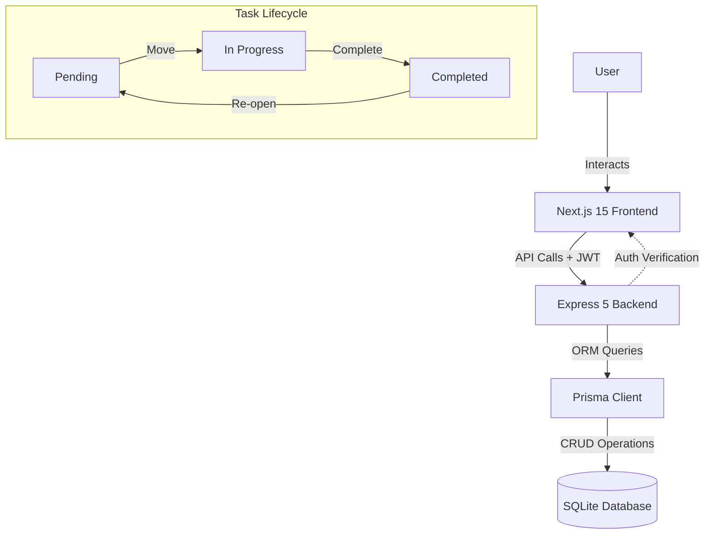

# Bread & Butter: Minimalist Task Workspace

**Bread & Butter** is a premium, Notion-inspired task management ecosystem designed for engineers, creators, and professionals who crave clarity. It strips away the noise of traditional project management tools, providing a high-fidelity, distraction-free environment to organize your "mission-critical" tasks with elegance and precision.

Built with a modern full-stack architecture (**Next.js 15**, **Express 5**, and **Prisma**), Bread & Butter is more than just a to-do list—it's a workspace designed to help you focus on what truly matters.

## 🏗️ Architecture & Workflow



---

##  Key Features

### **1. Unified Workspace Experience**
*   **Dual-Column Kanban Flow**: Manage your active workflow with a clean split between "Pending" and "In Progress" tasks.
*   **Archival Mastery**: A dedicated "Completed" view that keeps your workspace tidy while preserving your historical wins.
*   **Premium Notion Aesthetic**: Leveraging generous whitespace, a neutral color palette, and high-quality typography to reduce cognitive load.

### **2. Bank-Grade Authentication**
*   **Pro-Grade Auth**: Secure JWT-based registration and login with bcrypt hashing.
*   **HTTP-Only Cookies**: Refresh tokens are stored in `httpOnly` cookies, preventing XSS-based token theft.
*   **Robust Password Reset**: A dedicated recovery flow allowing users to regain access securely.
*   **Guest Mode Architecture**: Explore the dashboard immediately without local persistence—perfect for localized testing or quick brainstorming.

### **3. Precision Task Management**
*   **Priority Tiering**: Signal urgency with curated priority tags (Low, Medium, High).
*   **Intuitive "Check-on-Hover"**: A seamless UX pattern where checking off a task feels as satisfying as the work itself.
*   **Responsive Modals**: Context-aware editing flows that guide you through task creation without losing your place in the dashboard.

---

## 🛠️ Performance Tech Stack

| Layer | Technology | Rationale |
| :--- | :--- | :--- |
| **Frontend** | Next.js 15 (App Router) | High-performance Server Components & Client-side agility. |
| **Logic Layer** | React 19 + TypeScript | Type-safe development with modern hook patterns. |
| **Styling** | Tailwind CSS 4 | Custom design tokens and fluid glassmorphic transitions. |
| **Backend** | Node.js + Express 5 | Lightweight, scalable API with the latest middleware standards. |
| **Persistence** | SQLite + Prisma ORM | Zero-config local development with production-ready migrations. |

---

##  Engineering Challenges & Architectural Decisions

### **1. The Infinite Redirect Loop (Next.js Middleware)**
*   **The Challenge**: Configuring middleware to handle both authenticated users and "Guest Mode" users caused a conflict where the app would infinitely redirect between `/auth` and `/dashboard`.
*   **The Solution**: Moved the authentication guard from the edge (middleware) to the `DashboardLayout` component. This allowed for a more granular check of `localStorage` and `authContext` state before deciding to render the protected content.

### **2. Secure Token Management (XSS Mitigation)**
*   **The Challenge**: Storing both Access and Refresh tokens in `localStorage` makes the application vulnerable to cross-site scripting (XSS) attacks.
*   **The Solution**: Re-engineered the backend to issue Refresh Tokens via `httpOnly` cookies. The frontend now only stores the short-lived Access Token in memory, significantly hardening the application's security posture.

### **3. State Synchronization Across Views**
*   **The Challenge**: Changes made in a detail modal weren't immediately reflecting in the underlying board without a hard refresh.
*   **The Solution**: Implemented a global "Task Context" that leverages React's state to optimistically update the UI, providing a "snappy" feel before the backend confirmation arrives.

---

##  Debugging & Troubleshooting

### **Frequent Fixes Checklist**

| Issue | Typical Cause | Resolution |
| :--- | :--- | :--- |
| **401 Unauthorized** | Expired JWT or missing `Bearer` token. | The app handles this automatically via the `/refresh` endpoint. If persistent, clear browser cookies. |
| **SQLite "Database Locked"** | Concurrent writes during a migration. | Stop all dev servers and run `npm run prisma:migrate` again. Avoid manual SQLite edits. |
| **Hydration Mismatch** | Accessing browser APIs in SSR. | Wrap `localStorage` or `window` calls in `useEffect`. Use a "Client-Only" shell for dashboard components. |
| **CORS Policy Denials** | Backend `origin` mismatch. | Check `backend/.env` to ensure `FRONTEND_URL` matches your local Next.js port (usually 3000). |

### **Common Debugging Command**
If the database schema feels out of sync with your TypeScript types:
```bash
# In the /backend directory
npx prisma generate
npx prisma migrate dev
```

---

##  Future Growth & Improvements

We aren't stopping at simple CRUD. Here’s what’s on the horizon for Bread & Butter:

1.  **AI Priority Scoring**: A local LLM integration that analyzes your task descriptions and suggests priority levels based on urgency.
2.  **Collaborative Workspaces**: Real-time multi-user editing using WebSockets for team-based "Sprints."
3.  **Dark Mode "Midnight"**: A high-contrast, deep-charcoal theme for late-night productivity sessions.
4.  **Drag-and-Drop Kanban**: Implementing `dnd-kit` for a tactile experience when moving tasks between columns.
5.  **Offline-First Support**: Service Workers and IndexDB integration to allow task management in zero-connectivity environments.

---

## 🔧 Installation & Quick Start

1.  **Clone the Repo**: `git clone https://github.com/sakshepathak/BB-Task-Manager.git`
2.  **Backend Setup**:
    ```bash
    cd backend
    npm install
    # Setup .env (see backend/README.md)
    npm run prisma:migrate
    npm run dev
    ```
3.  **Frontend Setup**:
    ```bash
    cd frontend
    npm install
    npm run dev
    ```

---

## 📄 License
Licensed under the [MIT License](./LICENSE) - Created with ❤️ by **Sakshi Pathak**.
