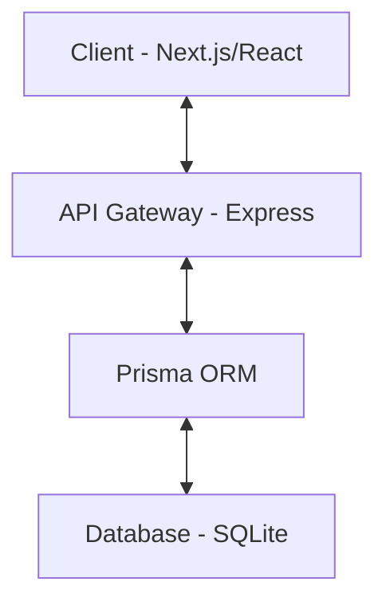

# Bread and Butter: A Modern Task Management System

Bread and Butter is a robust, full-stack task management application designed for productivity and ease of use. It provides features like user registration, secure login, and intuitive task management.

## Key Features

* **Secure Authentication**: JWT-based access and refresh tokens, password hashing with Bcrypt, and protected routes.
* **Efficient Task Management**: Create, view, update, and manage your tasks.
* **Responsive UI**: A sleek, modern dashboard built with Next.js and Tailwind CSS 4.
* **Typed Backend**: Robust API with Express 5, TypeScript, and Prisma ORM for type-safe database access.
* **Structured Architecture**: Modular design for both frontend and backend for easy maintenance and scaling.

## Project Architecture



The project is split into two main components:
* **[frontend/](./frontend)**: The user interface built with Next.js (App Router).
* **[backend/](./backend)**: The RESTful API built with Express, TypeScript, and Prisma.

## Getting Started

To get the project up and running locally, follow these steps:

### 1. Prerequisites
Ensure you have the following installed:
* [Node.js](https://nodejs.org/) (v18 or higher)
* [npm](https://www.npmjs.com/) (usually comes with Node.js)

### 2. Setting Up the Backend
Navigate to the `backend` directory:
```bash
cd backend
```
Install dependencies:
```bash
npm install
```
Configure your environment variables by creating a `.env` file:
```env
PORT=5000
DATABASE_URL="file:./dev.db"
JWT_ACCESS_SECRET="your-secret-key"
JWT_REFRESH_SECRET="your-refresh-secret-key"
```
Run Prisma migrations to set up the database:
```bash
npm run prisma:migrate
```
Start the development server:
```bash
npm run dev
```

### 3. Setting Up the Frontend
Navigate to the `frontend` directory:
```bash
cd ../frontend
```
Install dependencies:
```bash
npm install
```
Start the Next.js development server:
```bash
npm run dev
```
Open your browser and navigate to `http://localhost:3000`.

## Technology Stack

| Component | Technology |
| :--- | :--- |
| **Frontend** | [Next.js](https://nextjs.org/), [React](https://reactjs.org/), [Tailwind CSS 4](https://tailwindcss.com/) |
| **Backend** | [Express 5](https://expressjs.com/), [TypeScript](https://www.typescriptlang.org/), [Prisma](https://www.prisma.io/) |
| **Database** | [SQLite](https://sqlite.org/) |
| **Validation** | [Zod](https://zod.dev/) |
| **Security** | [JSON Web Token (JWT)](https://jwt.io/), [Bcryptjs](https://github.com/dcodeIO/bcrypt.js) |

## License

This project is licensed under the [ISC License](./LICENSE) (if applicable).
